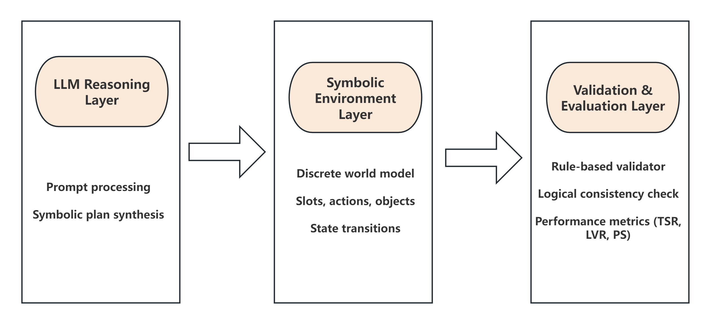
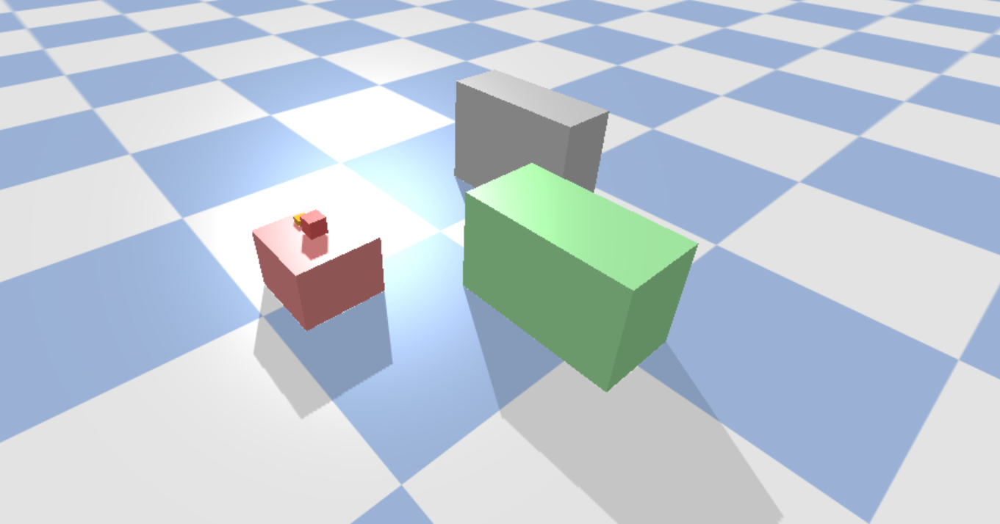
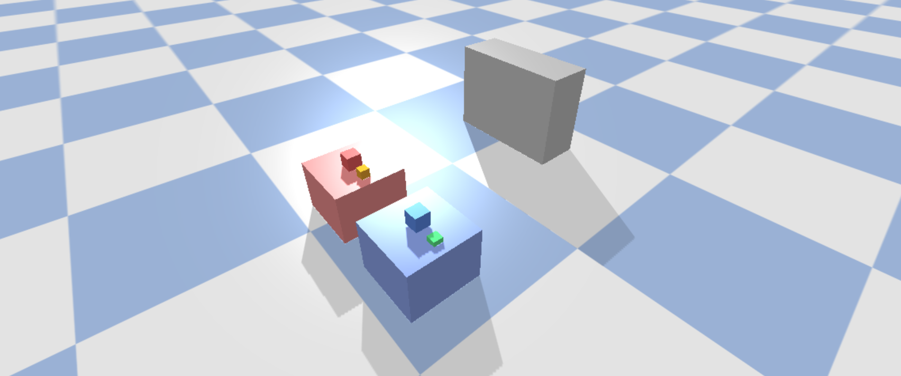
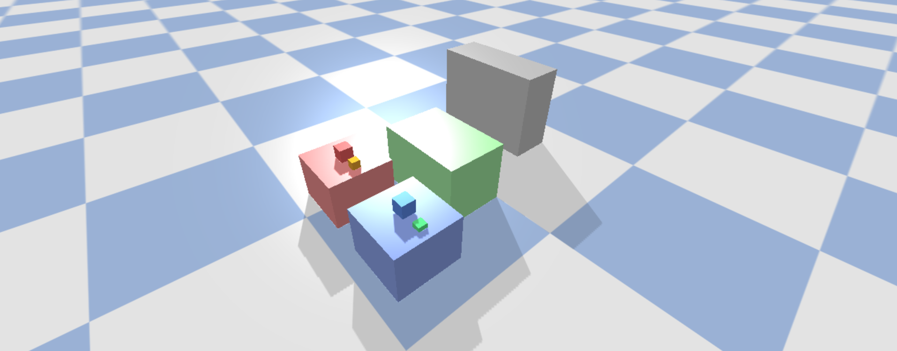
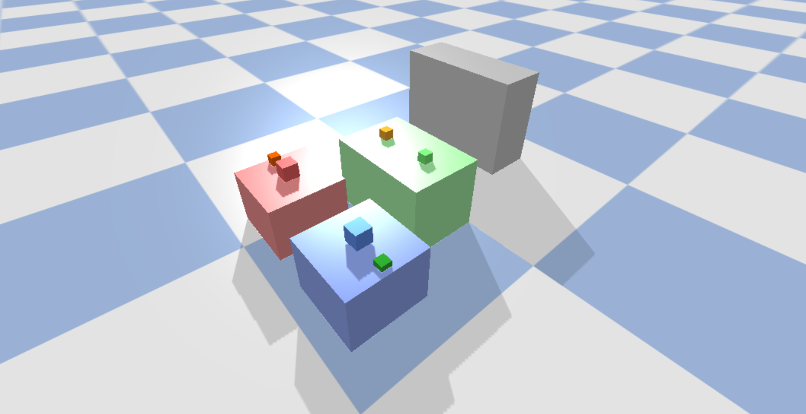
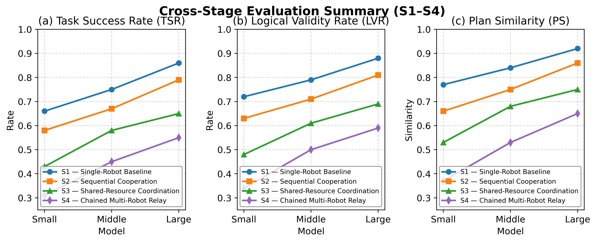

# Collaborative Multi-Robot Task Planning Using Large Language Models
Main Author(s) of the Project: Yixin Huang

## Table of Contents
- [Overview](#overview)
- [System Architecture](#system-architecture)
- [Installation & Usage](#installation--usage)
- [Simulations / Demos](#simulations--demos)
- [Configuration](#configuration)
- [Dependencies](#dependencies)
- [Data Logging & Evaluation](#data-logging--evaluation)
- [Contributing](#contributing)
- [License](#license)

---

## Overview
This project develops a modular symbolic reasoning framework for **multi-robot task planning using Large Language Models (LLMs)**.  
The system integrates high-level natural-language reasoning with symbolic validation, enabling interpretable and verifiable plan generation.

The framework models a **static warehouse environment** in which multiple robots collaborate through symbolic actions (`base.goto`, `arm.pick`, `arm.place`,`wait_until_free(S3|S4)`).  
Reasoning and evaluation occur purely at the **symbolic level**, ensuring reproducibility and logical transparency.

> Example application:  
> Symbolic task planning and coordination of warehouse robots using local LLM inference through the *Ollama* framework.

---

## System Architecture
The system adopts a **three-layer architecture** forming a reasoning–execution–verification loop:

1. **LLM Reasoning Layer** – Generates symbolic plans from standardized prompts.  
2. **Symbolic Environment Layer** – Defines robots, objects, and discrete world slots (PyBullet-based symbolic abstraction).  
3. **Validation & Evaluation Layer** – Performs rule-based logical checking and computes deterministic performance metrics (TSR, LVR, PS).



Each reasoning stage (S1–S4) extends the coordination complexity:
- **S1:** Single-robot symbolic reasoning and validation  
- **S2:** Sequential two-robot cooperation  
- **S3:** Shared-resource synchronization between robots  
- **S4:** Multi-robot relay collaboration with interdependent tasks  

### Repository Structure

The complete project is organized into modular folders corresponding to the four experimental stages (S1–S4), each implementing the same core symbolic reasoning pipeline with increasing coordination complexity.  

#### 🔹 Top-level directories
| Folder      | Description                               |
| ----------- | ----------------------------------------- |
| `S1/`       | Stage 1: Single-Robot Baseline            |
| `S2/`       | Stage 2: Sequential Two-Robot Cooperation |
| `S3/`       | Stage 3: Shared-Resource Coordination     |
| `S4/`       | Stage 4: Multi-Robot Relay Collaboration  |
| `figures/`  | Framework diagrams                        |
| `plots/`    | Evaluation result                         |
| `README.md` | Project overview and documentation        |

```
Each stage directory follows a unified internal structure:
```

#### 🔹 Inside each stage (`S1–S4`)
| Subfolder     | Key Files                                              | Description                                                  |
| ------------- | ------------------------------------------------------ | ------------------------------------------------------------ |
| `dataset/`    | `generate_dataset.py`                                  | Generates and stores symbolic datasets (`gold/`,`prompts/`)  |
| `env/`        | `make_world.py`, `actions_spec.py`, `run_demo.py`      | Defines symbolic world, available actions, and demo visualization |
| `llm/`        | `generate_llm_outputs_batch.py`                        | Generates LLM plans via standardized prompts(In `/dataset/llm_outputs`) |
| `validation/` | `validator.py`                                         | Performs logical rule-based validation                       |
| `eval/`       | `eval_combined_batch.py`, `eval_combined_results.json` | Evaluates plan success and symbolic correctness              |
| `figures/`    | `plot_overview.py`                                     | Stage-specific result plots                                  |

Each stage shares the same action schema:

```base.goto, arm.pick, arm.place, wait_until_free(S3|S4)```

while introducing higher levels of coordination complexity from S1 to S4.

This structure ensures full traceability between implementation modules and the methodology described in the thesis.

---

## Installation & Usage

### 1. Clone the repository
```bash
git clone https://github.com/Cyber-physical-Systems-Lab/warehouse-llm-planning.git
cd warehouse-llm-planning
```

### 2. Create the environment

```
conda create -n whsim python=3.10
conda activate whsim
pip install -r requirements.txt
```

### 3. Run symbolic dataset generation

```
cd S1/dataset
python generate_dataset.py
```

### 4. Generate LLM outputs (example for S1)

```
cd ../llm
python generate_llm_outputs_batch.py
```

### 5. Validate and evaluate

```
cd ../eval
python eval_combined_batch.py
```

For local LLM inference, the project supports **Ollama** models:

```
ollama run llama3
ollama run gemma3
ollama run qwen3
```

## Simulations / Demos

Each stage (S1–S4) visually demonstrates the reasoning and coordination process of the proposed symbolic framework.  
These visualizations are **illustrative demonstrations** rather than physical or dynamic simulations.  
Their purpose is to **show how the symbolic reasoning pipeline scales** from a single robot to multi-agent collaboration under increasing coordination complexity.

All reasoning, validation, and evaluation are performed purely at the **symbolic level** — no physics-based or trajectory-level simulation is involved.  
The images below are representative snapshots generated from symbolic execution logs and plan visualizations.

---

### **Stage 1 — Single-Robot Baseline**
- Symbolic pick-and-place reasoning with deterministic plan validation.  
- Demonstrates basic translation from natural-language prompt to symbolic plan.

<p align="center">
  
  <br>
  <em>Figure S1. Example symbolic reasoning result for a single-robot task.</em>
</p>


---

### **Stage 2 — Sequential Two-Robot Cooperation**
- Models ordered task execution between two robots.  
- Emphasizes sequential dependency handling in symbolic plans.

<p align="center">
  
  <br>
  <em>Figure S2. Example symbolic coordination between two robots.</em>
</p>


---

### **Stage 3 — Shared-Resource Coordination**
- Introduces synchronization through `wait_until_free` to enforce resource exclusivity.  
- Validates logical consistency in concurrent symbolic actions.

<p align="center">
  
  <br>
  <em>Figure S3. Shared-resource reasoning with symbolic synchronization constraints.</em>
</p>


---

### **Stage 4 — Multi-Robot Relay Collaboration**
- Demonstrates multi-agent reasoning with interdependent tasks.  
- Tests symbolic scalability and LLM reasoning under chained dependencies.

<p align="center">
  
  <br>
  <em>Figure S4. Symbolic relay collaboration illustrating reasoning scalability.</em>
</p>

## Configuration

All configuration files and parameters are defined within each stage directory (`S1–S4`).

Example configurable parameters include:

```
agents: 2
slots: ["Shelf.red.slot", "Inspection.slot", "RedBin.slot"]
actions: ["base.goto", "arm.pick", "arm.place", "wait_until_free"]
metrics: ["TSR", "LVR", "PS"]
```

Each stage can be customized by modifying its corresponding dataset and validation scripts.

------

## Dependencies

- **Python** 3.10
- **PyBullet** 3.2+
- **NumPy**, **Pandas**, **Matplotlib**
- **Ollama** (for local LLM inference)
- **Llama 3**, **Gemma 3**, **Qwen 3** models
- **Operating system:** Windows / Linux / macOS

> The project is fully runnable on a local GPU (e.g., NVIDIA RTX 3080)
>  and does not require any cloud-based inference.

------

## Data Logging & Evaluation

- Symbolic datasets stored under: `S*/dataset/{gold, llm_outputs, prompts}`
- Validation results saved in: `S*/eval/eval_combined_results.json`
- Visualization scripts in: `plots/` and `figures/`

Performance metrics:

- **TSR (Task Success Rate)** – Percentage of valid goal-reaching plans
- **LVR (Logical Validity Rate)** – Ratio of logically consistent plans
- **PS (Plan Similarity)** – Cosine similarity between gold-standard and generated plans

Example visualization:

```
<p align="center">
  
  <br>
  <em>overview_all_stages_evaluation</em>
</p>
```

------

## Contributing

This repository is part of **CPS-Lab**’s open research framework on symbolic reasoning and LLM-based planning.
 If you wish to extend or reproduce experiments:

1. Fork the repository
2. Create a feature branch (`feature/new-stage`)
3. Commit and push your changes
4. Submit a pull request for review

List of contributors:

- Yixin Huang (main author)
- CPS-Lab Team, Uppsala University

------

## License

This project is released under the **MIT License**.
 © 2025 Cyber-Physical Systems Laboratory, Uppsala University.