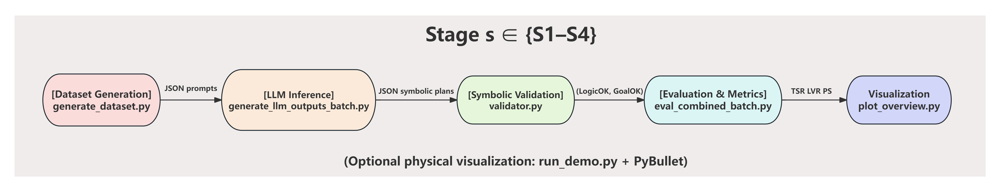

# Collaborative Multi-Robot Task Planning Using Large Language Models
Main Author of the Project: Yixin Huang

Supervisor: Ronald Cumbal | Reviewer: Didem Gürdür Broo

I would like to extend my deepest gratitude to my supervisor and reviewer for their invaluable guidance throughout my thesis project. The journey to completing this paper has been filled with ups and downs, and the full extent of the challenges I faced is something only I can truly know. However, I am incredibly fortunate and grateful to have had the support of the very best supervisor and reviewer.

## Table of Contents

- [Overview](#overview)
- [System Architecture](#system-architecture)
- [Repository Structure](#Repository Structure)
- [Installation & Usage](#installation--usage)
- [Simulations / Demos](#simulations--demos)
- [Configuration](#configuration)
- [Dependencies](#dependencies)
- [Data Logging & Evaluation](#data-logging--evaluation)
- [Contributing](#contributing)
- [License](#license)

---

## Overview

This repository provides a **fully reproducible symbolic planning benchmark** for evaluating the ability of Large Language Models (LLMs) to generate **logically valid multi-robot task plans**.

The system integrates:

- **LLM-based plan generation** (Llama3, Gemma3, Qwen3 via *Ollama*)
- A deterministic **symbolic warehouse environment** (robots, objects, slots)
- A rule-based **symbolic validator** that checks preconditions, effects, and invariants
- Stage-wise evaluation across **four benchmark scenarios (S1–S4)**

All reasoning and evaluation occur **purely at the symbolic level**.
 PyBullet is used only for optional visualization—physical simulation, dynamics, and collisions are **not** used.

### What this repository provides

- A unified symbolic action schema (`base.goto`, `arm.pick`, `arm.place`, `wait_until_free(S3|S4)`)
- Automatic prompt generation and LLM inference pipeline
- Deterministic validation of logical correctness and goal satisfaction
- Quantitative evaluation using TSR, LVR, and PS
- Four progressively harder multi-robot scenarios for benchmarking reasoning scalability

**Example use case:**
Evaluate how well different LLMs can generate logically correct symbolic plans for multi-robot warehouse tasks involving shared resources, mutual exclusion, and relay-style coordination.

## System Architecture

The project follows a **modular three-layer architecture** that mirrors the methodology used in the thesis.
 This structure cleanly separates:

1. **LLM reasoning**
2. **Symbolic environment modeling**
3. **Deterministic plan validation & evaluation**

This ensures that every stage (S1–S4) uses the exact same pipeline and symbolic rules.

<p align="center">
  
</p>

### 1. LLM Reasoning Layer

This layer converts structured natural-language prompts into **symbolic action plans**.

- Uses local LLM inference through **Ollama**
- Supports multiple open-source models (`llama3.2:1b`, `gemma3:4b`, `qwen3:8b`)
- Produces plans using the unified JSON schema:

```
{"agent": "robotA", "action": "arm.pick", "arg": "Shelf.red.slot"}
```

**Key Responsibilities**

- Encode task objectives and environment state into prompts
- Generate symbolic plans in a single forward pass
- Guarantee structural consistency through a strict JSON format

### 2. Symbolic Environment Layer

This layer defines a **discrete warehouse-style world** used for all stages (S1–S4).

It includes:

- symbolic slots (Shelf, Worktable, Inspection, Bin)
- robot poses & reachability
- object locations
- shared-resource constraints (e.g., single-occupancy inspection slot)
- precondition–effect rules for actions

Actions follow a fixed vocabulary:

```
base.goto
arm.pick
arm.place
wait_until_free  (used in S3–S4)
```

**Important:**
No physics, collisions, or motion planning are used.
PyBullet is only used to *optionally visualize* scenes—it does **not** affect validation.

### 3. Symbolic Validation Layer

All generated plans are executed by a **deterministic symbolic state machine**.

The validator checks:

#### Schema correctness

Correct fields, valid symbols, well-formed action entries.

#### Preconditions

Robot reachability, object existence, slot availability, shared-resources rules.

#### Effects

Update world state deterministically.

#### Invariants

- Each object appears exactly once
- Each robot holds ≤ 1 object
- Shared resources obey mutual exclusion

#### Goal satisfaction

Objects end in the correct slots; robots finish empty-handed.

This produces two binary outputs for every plan:

- **logic_ok** (symbolic consistency)
- **goal_ok** (task success)

### End-to-End Pipeline

All stages (S1–S4) follow the same unified process:

```
generate_dataset.py      →  creates prompts & gold plans
generate_llm_outputs.py  →  runs LLM inference
validator.py             →  checks plan correctness
eval_combined_batch.py   →  aggregates TSR/LVR/PS
plot_overview.py         →  visualization
```

The pipeline is fully deterministic and entirely symbolic.

### Architecture Diagram

<p align="center">
  
</p>

## Repository Structure

The complete project is organized into modular folders corresponding to the four experimental stages (S1–S4), each implementing the same core symbolic reasoning pipeline with increasing coordination complexity.  

#### 🔹 Top-level directories
| Folder      | Description                                              |
| ----------- | -------------------------------------------------------- |
| `S1/`       | Stage 1: Single-Robot Baseline                           |
| `S2/`       | Stage 2: Sequential Two-Robot Cooperation                |
| `S3/`       | Stage 3: Shared-Resource Coordination                    |
| `S4/`       | Stage 4: Multi-Robot Relay Collaboration (Chained Relay) |
| `figures/`  | Project diagrams                                         |
| `plots/`    | Evaluation result                                        |
| `README.md` | Project overview and documentation                       |

```
Each stage directory follows a unified internal structure:
```

#### 🔹 Inside each stage (`S1–S4`)
| Subfolder     | Key Files                                              | Description                                                  |
| ------------- | ------------------------------------------------------ | ------------------------------------------------------------ |
| `dataset/`    | `generate_dataset.py`                                  | Generates and stores symbolic datasets (`gold/`,`prompts/`)  |
| `env/`        | `make_world.py`, `actions_spec.py`, `run_demo.py`      | Defines the symbolic world, available actions, and an optional PyBullet-based scene visualization used only to illustrate the task logic (not for simulation or evaluation). |
| `llm/`        | `generate_llm_outputs_batch.py`                        | Generates LLM plans via standardized prompts(In `/dataset/llm_outputs`) |
| `validation/` | `validator.py`                                         | Performs logical rule-based validation                       |
| `eval/`       | `eval_combined_batch.py`, `eval_combined_results.json` | Evaluates plan success and symbolic correctness              |
| `figures/`    | `plot_overview.py`                                     | Stage-specific result plots                                  |

Each stage shares the same action schema:

```base.goto, arm.pick, arm.place, wait_until_free(S3|S4)```

while introducing higher levels of coordination complexity from S1 to S4.

This structure ensures full traceability between implementation modules and the methodology described in the thesis.

## Installation & Usage

### **1. Install Ollama**

Download and install:
 👉 https://ollama.ai

### **2. Pull required models**

```
ollama pull llama3.2:1b
ollama pull gemma3:4b
ollama pull qwen3:8b
```

### 3. Clone the repository

```
git clone https://github.com/Cyber-physical-Systems-Lab/warehouse-llm-planning.git
cd warehouse-llm-planning
```

### **4. Create Conda environment**

```
conda create -n llm-planning python=3.10
conda activate llm-planning
pip install -r requirements.txt
```

------

### **4. Generate datasets**

```
python S1/dataset/generate_dataset.py
...
(Here we use S1 as an example; S2–S4 follow the same command format.)
```

### **5. Run LLM inference**

Here, *small*, *middle*, and *large* correspond respectively to **llama3.2:1b**, **gemma3:4b**, and **qwen3:8b**.

```
cd S1/llm
python generate_llm_outputs_batch.py --model small
python generate_llm_outputs_batch.py --model middle
python generate_llm_outputs_batch.py --model large
...
(Here we use S1 as an example; S2–S4 follow the same command format.)
```

### **6. Validate & evaluate**

```
python S1/eval/eval_combined_batch.py
...
(Here we use S1 as an example; S2–S4 follow the same command format.)
```

### **7. Plot results**

```
python S1/figures/plot_overview.py
...
(Here we use S1 as an example; S2–S4 follow the same command format.)

python plots/plot_all_stages_overview.py
```

## Simulations / Demos

Each stage (S1–S4) provides an optional visual demonstration to illustrate
 **how the symbolic reasoning pipeline operates** as task complexity increases.
 These demos are **not physical or dynamic simulations** — their purpose is **only to visualize the logical structure of the tasks and the symbolic execution flow**.

- The visualizations show object locations, robot poses, and key interaction slots
   (e.g., the shared `Inspection.slot` in S3–S4).
- They are rendered using PyBullet **purely as a static scene builder and camera tool**.
- **No physics, collision handling, motion simulation, or dynamics** are used anywhere in the evaluation pipeline.

All actual reasoning, plan execution, and evaluation are performed entirely within the **deterministic symbolic validator**, independent of PyBullet.
 The demos simply help convey:

- how tasks are structured at each stage,
- how shared resources (e.g., inspection slot) constrain coordination,
- how multi-robot relay patterns are represented symbolically.

> **In short:**
>  The demos are *illustrations of symbolic logic*, not simulations of robot motion.

---

### **Stage 1 — Single-Robot Baseline**
- Symbolic pick-and-place reasoning with deterministic plan validation.  
- Demonstrates basic translation from natural-language prompt to symbolic plan.

<p align="center">
  
  <br>
  <em>Figure S1. Example symbolic reasoning result for a single-robot task.</em>
</p>


---

### **Stage 2 — Sequential Two-Robot Cooperation**
- Models ordered task execution between two robots.  
- Emphasizes sequential dependency handling in symbolic plans.

<p align="center">
  
  <br>
  <em>Figure S2. Example symbolic coordination between two robots.</em>
</p>


---

### **Stage 3 — Shared-Resource Coordination**
- Introduces synchronization through `wait_until_free` to enforce resource exclusivity.  
- Validates logical consistency in concurrent symbolic actions.

<p align="center">
  
  <br>
  <em>Figure S3. Shared-resource reasoning with symbolic synchronization constraints.</em>
</p>


---

### **Stage 4 — Multi-Robot Relay Collaboration**
- Demonstrates multi-agent reasoning with interdependent tasks.  
- Tests symbolic scalability and LLM reasoning under chained dependencies.

<p align="center">
  
  <br>
  <em>Figure S4. Symbolic relay collaboration illustrating reasoning scalability.</em>
</p>

## Configuration

All configuration files and parameters are defined within each stage directory (`S1–S4`).

Example configurable parameters include:

```
agents: 2
slots: ["Shelf.red.slot", "Inspection.slot", "RedBin.slot"]
actions: ["base.goto", "arm.pick", "arm.place", "wait_until_free"]
metrics: ["TSR", "LVR", "PS"]
```

Each stage can be customized by modifying its corresponding dataset and validation scripts.

------

## Dependencies

- **Python** 3.10
- **PyBullet** 3.2+
- **NumPy**, **Pandas**, **Matplotlib**
- **Ollama** (for local LLM inference)
- **Llama 3**, **Gemma 3**, **Qwen 3** models
- **Operating system:** Windows / Linux / macOS

> The project is fully runnable on a local GPU (e.g., NVIDIA RTX 4090)
>  and does not require any cloud-based inference.

------

## Data Logging & Evaluation

- Symbolic datasets stored under: `S*/dataset/{gold, llm_outputs, prompts}`
- Validation results saved in: `S*/eval/eval_combined_results.json`
- Visualization scripts in: `plots/` and `figures/`

Performance metrics:

- **TSR (Task Success Rate)** – Percentage of valid goal-reaching plans
- **LVR (Logical Validity Rate)** – Ratio of logically consistent plans
- **PS (Plan Similarity)** – Cosine similarity between gold-standard and generated plans

Example visualization:

<p align="center">
  
  <br>
  <em>Figure: overview_all_stages_evaluation</em>
</p>

------

## Contributing

This repository is part of **CPS-Lab**’s open research framework on symbolic reasoning and LLM-based planning.
 If you wish to extend or reproduce experiments:

1. Fork the repository
2. Create a feature branch (`feature/new-stage`)
3. Commit and push your changes
4. Submit a pull request for review

List of contributors:

- Yixin Huang (main author)
- CPS-Lab Team, Uppsala University

------

## License

This project is released under the **MIT License**.
 © 2025 Cyber-Physical Systems Laboratory, Uppsala University.